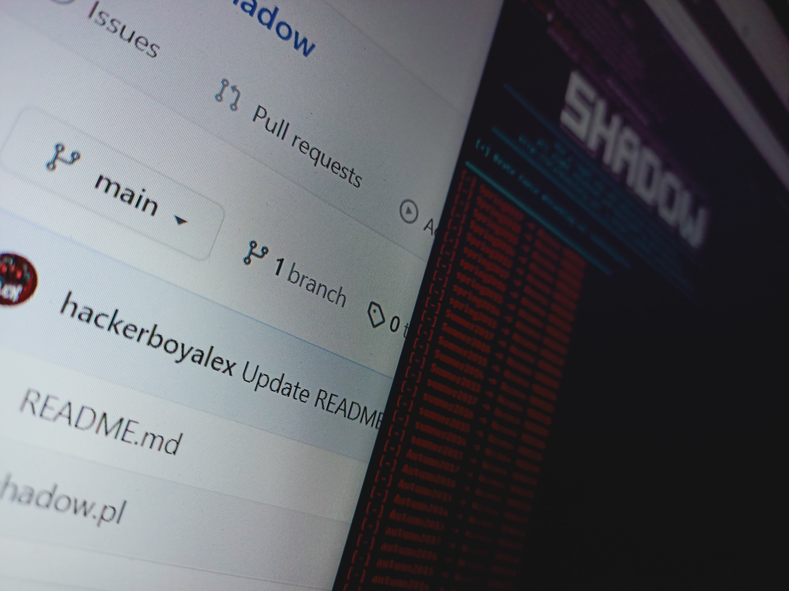
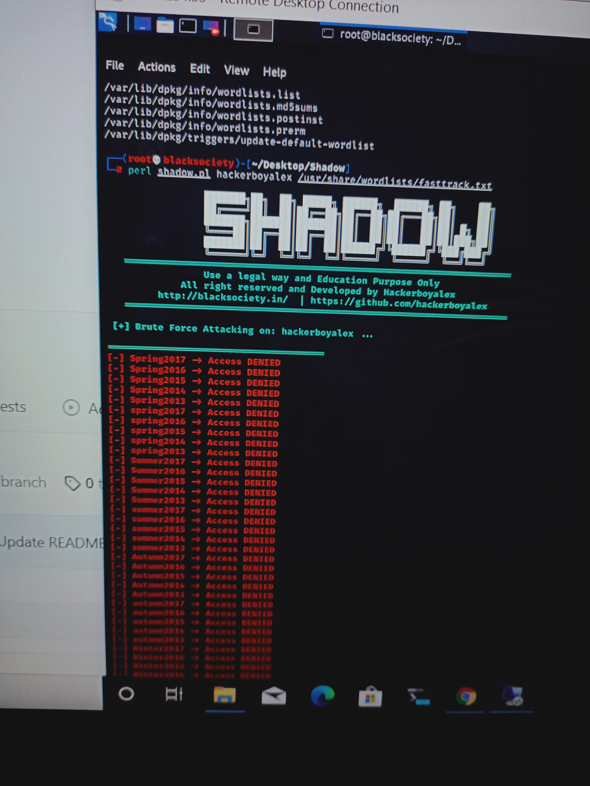

# Shadow
A "Shadow" use a  brute-force technique where attackers run through WordList (Dictionary).

# Images

# Requirements:
1) Linux (Kali Linux, Parrot OS, etc)
2) Perl Install 
3) WordList ( Download from Internet or make own Wordlist)
4) Fast Internet Conection
5) Tor Install (optional)

# Usage :
rolt@alex:~# service tor start/stop

root@alex:~# git clone https://github.com/hackerboyalex/Shadow

root@alex:~# cd Shadow

root@alex:~# crunch 8 10 1234567890 -o /root/Desktop/Shadow/wordlist.txt
( I have Create my own word list with help of crunch or You have wordlist then you skip this)
 
root@alex:~# perl shadow "hackerboyalex" (victim id) "worlist.txt" (your wordlist path)

# Terms & Conditions

Warning : These Tool using only for education and knowledge perpose. If use illegal way then your these responsibility.

We strictly recommend not to use this demonstration for harmful purposes.

# Copyright : 
Copyright Disclaimer under Section 107 of the copyright act 1976, allowance is made for fair use for purposes such as criticism,
comment, news reporting, scholarship, and research.
Fair use is a use permitted by copyright statute that might otherwise be infringing.
Non-profit, educational or personal use tips the balance in favour of fair use.

